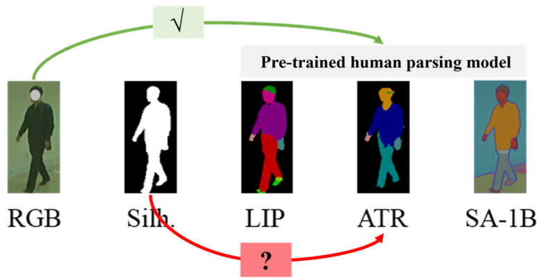

# LandmarkGait 

Official code for "LandmarkGait: Intrinsic Human Parsing for Gait Recognition" (ACM MM 2023).

<!-- Zengbin Wang, Saihui Hou, Man Zhang, Xu Liu, Chunshui Cao, Yongzhen Huang, Shibiao Xu -->

[](https://dl.acm.org/doi/abs/10.1145/3581783.3611840)

------------------------------------------

## Motivation

<div align="center">
       
</div>

Some challenges when apply human parsing to gait recognition:
* lack of RGB modality
* lack of annotated body parts
* difficulty in balancing parsing quantity and quality 

## Introduction

<div align="center">
       
</div>

<!-- We propose LandmarkGait, an accessible and alternative parsing-based solution for gait recognition. -->
We propose LandmarkGait, an unsupervised parsing-based solution that focuses on specific complete body part representations from original binary silhouettes for gait recognition, including ''Silhouette-to-Landmarks'', ''Landmarks-to-Parsing'', and ''Recognition''

* **LandmarkNet** (Unsupervised Landmark Discovery, Silhouette-to-Landmarks) allows transforming dense silhouette into a finite set of landmarks with remarkable consistency across various conditions in an unsupervised manner.
* **ParsingNet** (Human Parsing Network, Landmarks-to-Parsing) is a lightweight human parsing network to efficiently generate human parsing from well-aligned landmarks. 
* **Multi-scale Feature Extraction Network** (Recognition) can take advantage of multiple sources of rich information, including multi-scale inputs (holistic silhouettes, finely parsing parts, and mixed parsing parts within a sequence) and multi-scale convolutions, enabling fine-grained feature extraction.

## Getting Started

1. clone this repo.
    ```
    git clone git@github.com:wzb-bupt/LandmarkGait.git
    ```

2. Install dependenices:
    - pytorch >= 1.10
    - torchvision
    - pyyaml
    - tensorboard
    - opencv-python
    - tqdm
    - py7zr
    - kornia
    - einops
    - six

    Install dependenices by [Anaconda](https://conda.io/projects/conda/en/latest/user-guide/install/index.html):
    ```
    conda install tqdm pyyaml tensorboard opencv kornia einops six -c conda-forge
    conda install pytorch==1.10 torchvision -c pytorch
    ```    
    Or, Install dependenices by pip:
    ```
    pip install tqdm pyyaml tensorboard opencv-python kornia einops six
    pip install torch==1.10 torchvision==0.11
    ```

3. Prepare dataset
    - In most cases, we strictly follow the setting of [OpenGait](https://github.com/ShiqiYu/OpenGait/blob/master/docs/2.prepare_dataset.md).
    - Differently, since CASIA-B uses outdated background subtraction algorithm, we utilize a re-segment version from [Ren et al](https://arxiv.org/pdf/2207.11720) as CASIA-BN. You can find our segmentation results from [this url](https://github.com/wzb-bupt/GaitParsing).


## Training Details

To achieve better convergence, we first train LandmarkNet and ParsingNet sequentially to obtain spatio-temporally consistent landmarks and parsing parts. Subsequently, we fix the encoder of LandmarkNet and use pre-trained weights to initiate these two networks and jointly train the subsequent recognition network end-to-end for final gait recognition.

### Step1: LandmarkNet (Silhouette-to-Landmarks, [config](configs/landmarkgait_release/LandmarkGait_Silh_to_Landmark.yaml))

```
CUDA_VISIBLE_DEVICES=0,1,2,3 python -m torch.distributed.launch --nproc_per_node=4 opengait/main.py --cfgs ./configs/landmarkgait/LandmarkGait_Silh_to_Landmark.yaml --phase train --log_to_file
```

### Step2: ParsingNet (Landmarks-to-Parsing, [config](configs/landmarkgait_release/LandmarkGait_Landmark_to_Parsing.yaml))
```
CUDA_VISIBLE_DEVICES=0,1,2,3 python -m torch.distributed.launch --nproc_per_node=4 opengait/main.py --cfgs ./configs/landmarkgait/LandmarkGait_Landmark_to_Parsing.yaml --phase train --log_to_file
```

### Step3: Multi-scale Feature Extraction Network (PMBC-Net, Recognition and Evaluation, [config](configs/landmarkgait_release/LandmarkGait_Recognition.yaml)) 
```
CUDA_VISIBLE_DEVICES=0,1,2,3 python -m torch.distributed.launch --nproc_per_node=4 opengait/main.py --cfgs ./configs/landmarkgait/LandmarkGait_Recognition.yaml --phase train --log_to_file
```
```
CUDA_VISIBLE_DEVICES=0,1,2,3 python -m torch.distributed.launch --nproc_per_node=4 opengait/main.py --cfgs ./configs/landmarkgait/LandmarkGait_Recognition.yaml --phase test --log_to_file
```


## Visual Results

<div align="center">
       
</div>


## Citing Our Paper

If you find this codebase useful in your research, please consider citing:

    @inproceedings{wang2023landmarkgait,
        title={LandmarkGait: Intrinsic Human Parsing for Gait Recognition},
        author={Wang, Zengbin and Hou, Saihui and Zhang, Man and Liu, Xu and Cao, Chunshui and Huang, Yongzhen and Xu, Shibiao},
        booktitle={Proceedings of the 31st ACM International Conference on Multimedia (ACM MM)},
        pages={2305--2314},
        year={2023}
    }

For any questions, please contact Zengbin Wang (wzb1@bupt.edu.cn).

## Acknowledgement

Our code is built upon the great open-source project [OpenGait](https://github.com/ShiqiYu/OpenGait).

